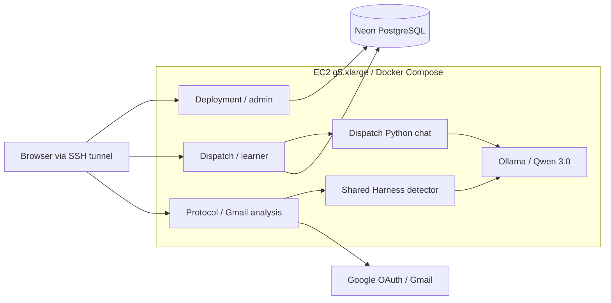
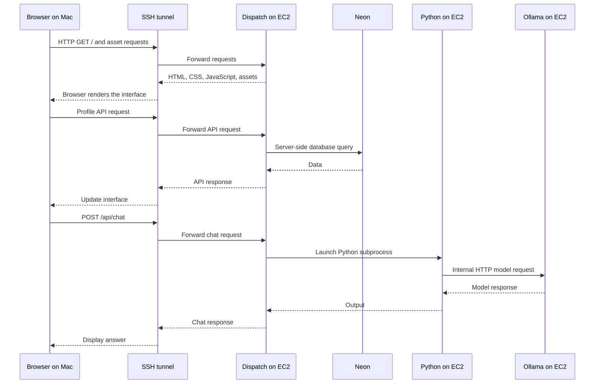

# SENTRI architecture

Updated: 2026-10-02. Active workspace: `SENTRI-fresh`.

## Running private deployment topology

The Docker configuration targets one EC2 g5.xlarge running Deployment, Dispatch,
Protocol, and Ollama. PostgreSQL remains hosted on Neon. User-supplied EC2 terminal output confirms successful app image builds and
all four containers running with healthy status. This records the deployed
snapshot, not a claim that later local changes have been deployed.

Python chat and the Harness detector are subprocesses inside their respective
app containers, not separate network services. The full Harness asset directory
is copied beside each app; Dispatch also imports its shared scoring JSON.
The Harness CLI supports planning, generation, and chat but is not an automatic
background content-ingestion worker.

## Configuration and persistence

- Root `.env` supplies runtime credentials, independent app session secrets, and
  `SENTRI_MODEL`. Local app environment files are excluded from image builds.
- Deployment and Dispatch connect to the intended shared Neon database/branch.
  Compose performs no database migration or seeding.
- Model clients use `http://ollama:11434` on the private Compose network.
  The confirmed Qwen 3.0 tag is `huihui_ai/qwen3-abliterated:latest`. Its
  approximately 5 GB download succeeded inside the Docker model volume.
  Parameter count and quantization have not been independently verified.
- The GPU overlay grants Ollama NVIDIA GPU access. Host drivers and NVIDIA
  Container Toolkit are required. A named volume persists downloaded models.
- Protocol sessions and OAuth tokens remain in process memory; restarts require
  reconnecting Gmail. No persistent token store is introduced by Docker.

## Access and readiness

App ports bind to EC2 loopback and are accessed through an SSH tunnel for the
private pilot. Ollama has no published host port. Protocol retains its explicit
loopback-origin checks and loopback Google callback. Public deployment requires
HTTPS and an intentional Protocol origin/access/session design. Deployment uses
database authentication; its production session cookies require a secure browser
context. See the Docker guide for private login caveats.

Verified from user-supplied EC2 output on 2026-10-02:

- Ubuntu 26.04.1; Docker hello-world passed; Compose v5.5.1 installed.
- NVIDIA Container Toolkit installed; an Ubuntu test container sees the A10G GPU.
- Deployment, Dispatch, and Protocol images built successfully.
- All three app containers and Ollama report healthy.
- Model pull succeeded; the Harness status command returns `ready: true` for
  `huihui_ai/qwen3-abliterated:latest`.

Still unverified: browser access through the tunnel, Neon login/data operations,
actual Qwen inference and its GPU use, and Gmail OAuth/email analysis. Model
installation and HTTP health checks alone do not prove those workflows work.
The local workspace currently contains an unfinished merge, including a conflict
in `protocol/README.md`. Those incoming changes are not established as deployed;
resolve and test them before rebuilding the server from that working tree.

## Related documents

- [Docker setup and operating guide](../docker/README.md)
- [Technical decisions](DECISIONS.md)
- [Changelog](CHANGELOG.md)
- [Dispatch historical architecture review](../dispatch/ARCHITECTURE.md)
- [Protocol behavior and limitations](../protocol/README.md)
- [Harness behavior](../ai-harness/README.md)

## Browser, HTTP, API, and tunnel responsibilities

Chrome or Safari on the user's Mac renders HTML, CSS, JavaScript, images, and
fonts returned by the Next.js server. Interface JavaScript executes in the
browser; Next.js server code, Python, and Ollama execute on EC2. This is web
content delivery, not remote-screen video streaming.

`-L 3000:127.0.0.1:3000` tells SSH to listen on the Mac's port 3000 and
forward connections to EC2's loopback port 3000. Docker maps that EC2 port into
Dispatch's container port 3000. Deployment uses host port 3002 and Protocol uses
3003, each also mapped to port 3000 inside its own container. The local browser
URL is the tunnel entrance, not evidence of a locally running application server.

Closing the tunnel or turning off the Mac stops that access path but does not
stop EC2 containers. A future public HTTPS domain and reverse proxy would replace
the browser's need for an SSH tunnel. That public configuration is not yet enabled.
Neon credentials stay in server configuration; the browser does not receive them.
