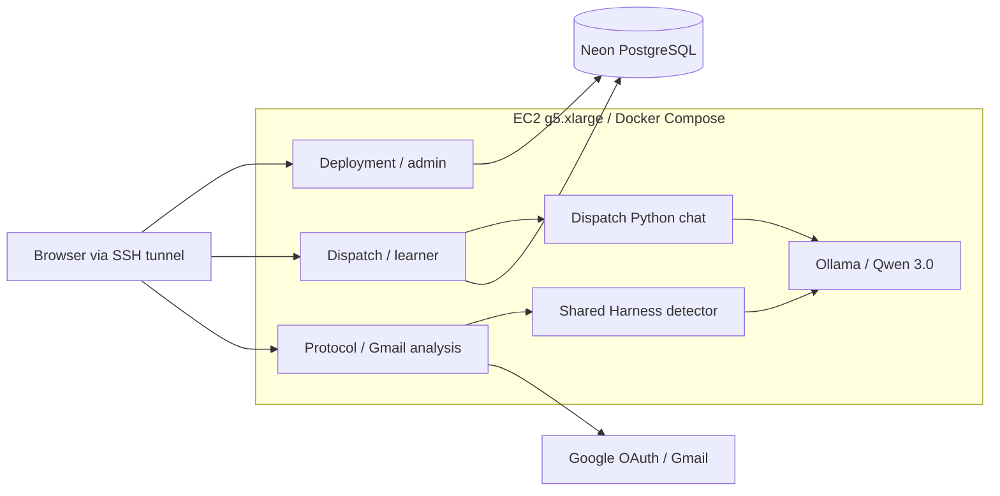

# SENTRI architecture

Updated: 2026-10-02. Active workspace: `SENTRI-fresh`.

## Prepared deployment topology

The Docker configuration targets one EC2 g5.xlarge running Deployment, Dispatch,
Protocol, and Ollama. PostgreSQL remains hosted on Neon. These configuration
files have been prepared; container builds and live EC2 validation are pending.

Python chat and the Harness detector are subprocesses inside their respective
app containers, not separate network services. The full Harness asset directory
is copied beside each app; Dispatch also imports its shared scoring JSON.
The Harness CLI supports planning, generation, and chat but is not an automatic
background content-ingestion worker.

## Configuration and persistence

- Root `.env` supplies runtime credentials, independent app session secrets, and
  `SENTRI_MODEL`. Local app environment files are excluded from image builds.
- Deployment and Dispatch connect to the intended shared Neon database/branch.
  Compose performs no database migration or seeding.
- Model clients use `http://ollama:11434` on the private Compose network.
  Qwen 3.0 is the confirmed family; exact installed tag, size, and quantization
  must be checked with `ollama list`. No model has been downloaded by this task.
- The GPU overlay grants Ollama NVIDIA GPU access. Host drivers and NVIDIA
  Container Toolkit are required. A named volume persists downloaded models.
- Protocol sessions and OAuth tokens remain in process memory; restarts require
  reconnecting Gmail. No persistent token store is introduced by Docker.

## Access and readiness

App ports bind to EC2 loopback and are accessed through an SSH tunnel for the
private pilot. Ollama has no published host port. Protocol retains its explicit
loopback-origin checks and loopback Google callback. Public deployment requires
HTTPS and an intentional Protocol origin/access/session design. Deployment uses
database authentication; its production session cookies require a secure browser
context. See the Docker guide for private login caveats.

YAML parsing and package/lockfile consistency checks passed. Docker builds, GPU
inference, Neon authentication, and Gmail end-to-end validation remain pending.

## Related documents

- [Docker setup and operating guide](docker/README.md)
- [Technical decisions](DECISIONS.md)
- [Changelog](CHANGELOG.md)
- [Dispatch historical architecture review](dispatch/ARCHITECTURE.md)
- [Protocol behavior and limitations](protocol/README.md)
- [Harness behavior](ai-harness/README.md)
